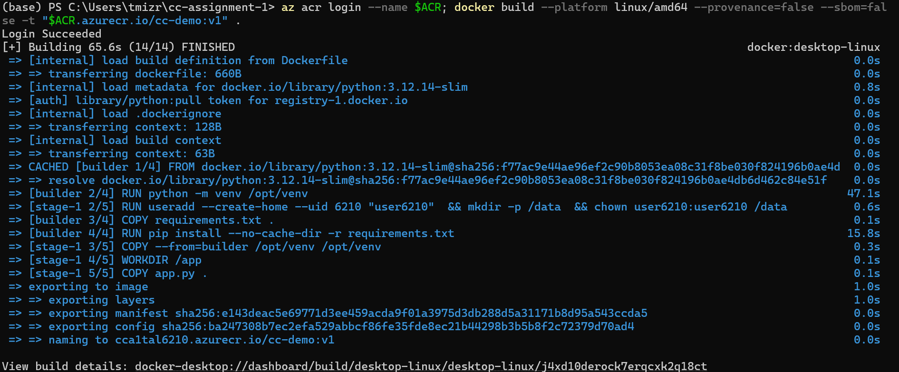
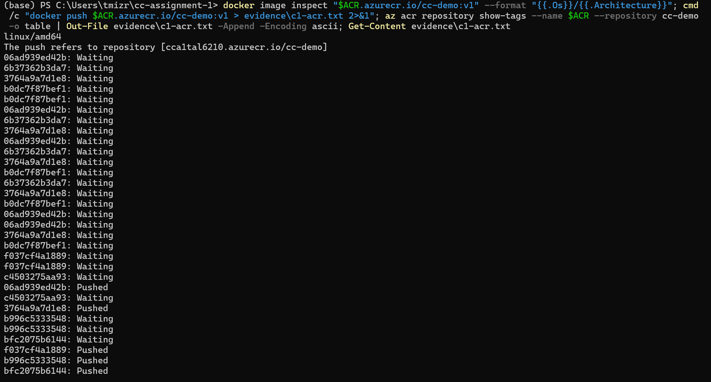
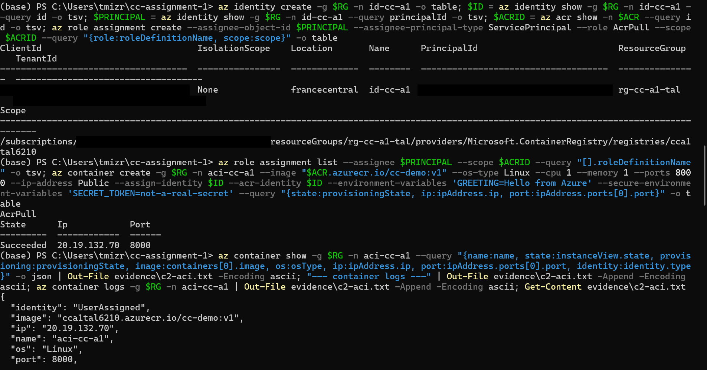
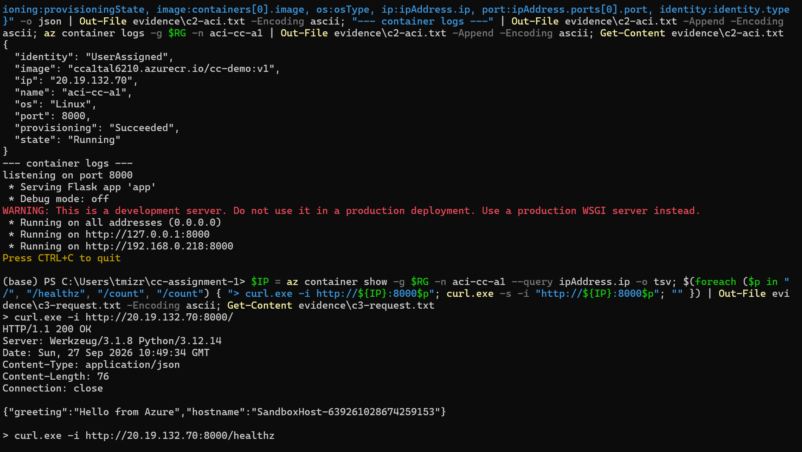
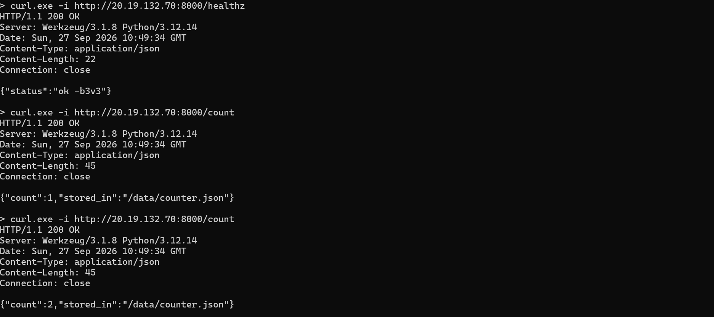
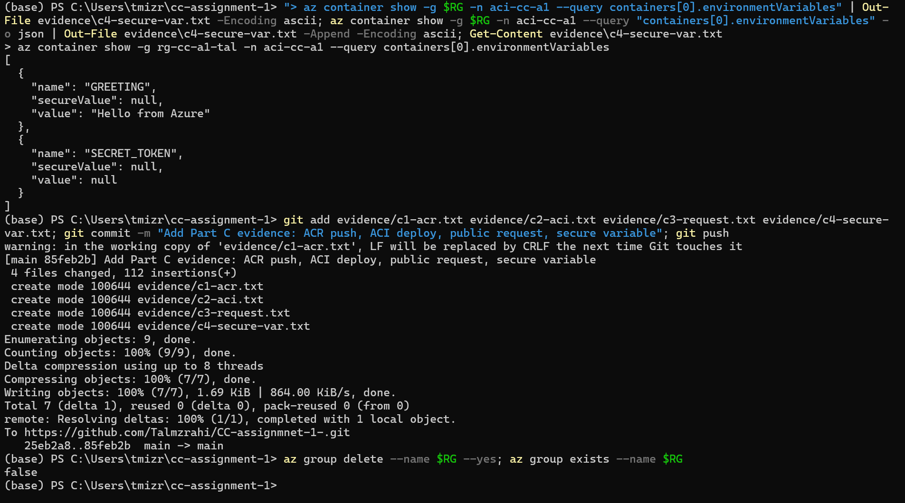

# Assignment 1 — Containerise and deploy

> Replace every `TODO` and delete this quote block before submitting. The headings below
> map onto the rubric — keeping them makes it hard to lose marks for something you
> actually did. Answer in prose, not bullet fragments.

**Name:** TODO
**Campus:** TODO

## What this is

TODO — two or three sentences. What the application does and what you did to it.

## Build and run it locally

Commands someone else can paste, in order, with no edits beyond a name or a path.

```bash
docker build -t cc-app:1.0 .
docker run -d --name cc -p 8000:8000 -v ccdata:/data cc-app:1.0
sleep 3
curl http://localhost:8000/
curl http://localhost:8000/count
curl http://localhost:8000/healthz
docker exec cc id
```

Expected output:

```
{"greeting":"Hello from the container","hostname":"2a68251746b0"}
{"count":1,"stored_in":"/data/counter.json"}
{"status":"ok"}
uid=6210(user6210) gid=6210(user6210) groups=6210(user6210)
```

Show the counter surviving a container restart:

```bash
curl.exe http://localhost:8000/count
docker rm -f cc
docker run -d --name cc -p 8000:8000 -v ccdata:/data cc-app:1.0
Start-Sleep 3
curl.exe http://localhost:8000/count

{"count":2,"stored_in":"/data/counter.json"}
cc
1e5bb1b5888aae21b6f1d8b074069b049506d198d3d03fa72b54b48860c1762d
{"count":3,"stored_in":"/data/counter.json"}
```


Overriding configuration at run time:

```bash
docker run -d --name cc -p 8000:8000 -v ccdata:/data -e GREETING="Hi from Tal" cc-app:1.0
Start-Sleep 3
curl.exe http://localhost:8000/
cc
03db806302e5f84b380e80442db56ef84ef57dac83d94fd8d0f794648e285d07
{"greeting":"Hi from Tal","hostname":"03db806302e5"}
```

## Configuration

|| Variable | Default | What it does |
|:--|:--|:--|
| `GREETING` | `Hello from the container` | Text returned by `GET /`. Override with `-e GREETING="..."` to change the response without rebuilding. |
| `DATA_DIR` | `/data` | Folder where the counter file is stored. Matches the `VOLUME` and the folder owned by `user6210`, so the named volume can be written to. |
| `PORT` | `8000` | Port the app listens on inside the container. Published to the host with `-p <host>:8000`. |


## Part B — layers and cache

### B1 — image size

Sizes are the sum of each image's layers from `docker history` (uncompressed). The
compressed size that is actually pushed and pulled (`CONTENT SIZE` in `docker image ls`)
is given in brackets. All three images were built natively for linux/arm64.

| Build | Base | Stages | Size |
|:--|:--|--:|--:|
| A — single-stage, full base | `python:3.12.14` | 1 | ≈ 1,217 MB (405 MB) |
| B — single-stage, slim base | `python:3.12.14-slim` | 1 | ≈ 175 MB (48.5 MB) |
| C — my `Dockerfile` | `python:3.12.14-slim` | 2 | ≈ 179 MB (49.1 MB) |

| Step | Saves | What left the image |
|:--|--:|:--|
| A → B | ≈ 1,042 MB | Compilers, development headers and tools (gcc, g++, imagemagick, git, etc.) from the full base image's `apt-get install` layers, and a larger Debian base layer |
| B → C | ≈ −4 MB (C is bigger) | Nothing significant; C gained a second copy of pip inside `/opt/venv` |

Evidence (full output in `evidence/b1-sizes.txt` and `evidence/b1-site-packages.txt`):

```
IMAGE       ID             DISK USAGE   CONTENT SIZE   EXTRA
cc-demo:a   d2a54a60a9ca       1.62GB          405MB
cc-demo:b   bd2d89035528        223MB         48.5MB
cc-demo:c   0d7938084e70        228MB         49.1MB   U
```

TODO — attribute each of the two differences. Which one did more work, and what is
physically in the layers that disappeared at each step?

A-B:        there is a difference of 1042mb because a uses python and not python-slim. But this is wasted as even though they are still part of the image, so they are stored and downloaded every time, the Flask app never uses them when it runs because it only needs Python and Flask.

B-C:        The base layer is the same. The only difference is that C has pip twice which makes it heavier with no additional benefits. this is a difference of 4mb.

Multi-stage did not help here because the builder stage had nothing big to leave behind: installing Flask needs no compilers or build tools. So A→B saved much more (about 1,042 MB) than B→C, which saved nothing.


TODO — now generalise. Describe an application where the B → C saving would be far larger
than it is here, and say what about that application makes the difference.


In a case where a dependency is being installed that needs to be compiled every time you create a new image, rather than using a binary, it will have to also use the compiler tools like GCC. Those ones are going to create the actual size difference, not the app or the dependency itself that it's using. An example of this would be a Flask app that utilizes PostgreSQL through psycopg2.


### B2 — changing one line of source

I changed the response of the `/healthz` endpoint in `app.py` 
to `"ok -b2"`. `COPY app.py .` was the layer that was 
rebuilt, as Docker found a change in `app.py` that wasn't 
built yet. The rest of the instructions in the Dockerfile 
stayed cached, as Docker only cares about inputs and 
instructions, and they didn't change besides `app.py`. When a step changes, all the steps after it have to rebuild while the steps before it stay cached, and since `COPY app.py .` is near the end of the Dockerfile, after `pip install`, the dependency install stayed cached. In a Dockerfile with a different order this might not be the case. 


```
#6 [builder 1/4] FROM docker.io/library/python:3.12.14-slim@sha256:f77ac9e44ae96ef2c90b8053ea08c31f8be030f824196b0ae4db6d462c84e51f
#6 resolve docker.io/library/python:3.12.14-slim@sha256:f77ac9e44ae96ef2c90b8053ea08c31f8be030f824196b0ae4db6d462c84e51f 0.0s done
#6 DONE 0.0s

#7 [builder 2/4] RUN python -m venv /opt/venv
#7 CACHED

#8 [builder 3/4] COPY requirements.txt .
#8 CACHED

#9 [stage-1 3/5] COPY --from=builder /opt/venv /opt/venv
#9 CACHED

#10 [builder 4/4] RUN pip install --no-cache-dir -r requirements.txt
#10 CACHED

#11 [stage-1 2/5] RUN useradd --create-home --uid 6210 "user6210"  && mkdir -p /data  && chown user6210:user6210 /data
#11 CACHED

#12 [stage-1 4/5] WORKDIR /app
#12 CACHED

#13 [stage-1 5/5] COPY app.py .
#13 DONE 0.0s

#14 exporting to image
#14 exporting layers 0.1s done
#14 naming to docker.io/library/cc-demo:b2 done
#14 DONE 0.3s
```

### B3 — making the cache worse

TODO — show the reordered Dockerfile, paste the build output next to the output from B2,
and state the rule you broke in one sentence.

`Dockerfile.bad` is the same as `Dockerfile` except that `COPY app.py .` has moved to the
top of the builder stage, and the final stage copies it from the builder:

```dockerfile
FROM python:3.12.14-slim AS builder
COPY app.py .
RUN python -m venv /opt/venv
ENV PATH="/opt/venv/bin:$PATH"
COPY requirements.txt .
RUN pip install --no-cache-dir -r requirements.txt
...
COPY --from=builder /app.py .
```

Build output after changing `/healthz` to `"ok -b3v3"` (full log in `evidence/b3-cache.txt`):

```
#6 [builder 1/5] FROM docker.io/library/python:3.12.14-slim@sha256:f77ac9e44ae96ef2c90b8053ea08c31f8be030f824196b0ae4db6d462c84e51f
#6 resolve docker.io/library/python:3.12.14-slim@sha256:f77ac9e44ae96ef2c90b8053ea08c31f8be030f824196b0ae4db6d462c84e51f 0.0s done
#6 CACHED

#7 [builder 2/5] COPY app.py .
#7 DONE 0.0s

#8 [builder 3/5] RUN python -m venv /opt/venv
#8 DONE 3.4s

#9 [builder 4/5] COPY requirements.txt .
#9 DONE 0.1s

#10 [builder 5/5] RUN pip install --no-cache-dir -r requirements.txt
#10 0.614 Collecting flask==3.1.0 (from -r requirements.txt (line 1))
#10 0.689   Downloading flask-3.1.0-py3-none-any.whl.metadata (2.7 kB)
#10 0.729 Collecting Werkzeug>=3.1 (from flask==3.1.0->-r requirements.txt (line 1))
#10 0.742   Downloading werkzeug-3.1.8-py3-none-any.whl.metadata (4.0 kB)
#10 0.767 Collecting Jinja2>=3.1.2 (from flask==3.1.0->-r requirements.txt (line 1))
#10 0.779   Downloading jinja2-3.1.6-py3-none-any.whl.metadata (2.9 kB)
#10 0.813 Collecting itsdangerous>=2.2 (from flask==3.1.0->-r requirements.txt (line 1))
#10 0.825   Downloading itsdangerous-2.2.0-py3-none-any.whl.metadata (1.9 kB)
#10 0.857 Collecting click>=8.1.3 (from flask==3.1.0->-r requirements.txt (line 1))
#10 0.870   Downloading click-8.5.0-py3-none-any.whl.metadata (2.6 kB)
#10 0.884 Collecting blinker>=1.9 (from flask==3.1.0->-r requirements.txt (line 1))
#10 0.899   Downloading blinker-1.9.0-py3-none-any.whl.metadata (1.6 kB)
#10 0.951 Collecting MarkupSafe>=2.0 (from Jinja2>=3.1.2->flask==3.1.0->-r requirements.txt (line 1))
#10 0.965   Downloading markupsafe-3.0.3-cp312-cp312-manylinux2014_aarch64.manylinux_2_17_aarch64.manylinux_2_28_aarch64.whl.metadata (2.7 kB)
#10 0.978 Downloading flask-3.1.0-py3-none-any.whl (102 kB)
#10 1.000 Downloading blinker-1.9.0-py3-none-any.whl (8.5 kB)
#10 1.034 Downloading click-8.5.0-py3-none-any.whl (125 kB)
#10 1.056 Downloading itsdangerous-2.2.0-py3-none-any.whl (16 kB)
#10 1.071 Downloading jinja2-3.1.6-py3-none-any.whl (134 kB)
#10 1.106 Downloading werkzeug-3.1.8-py3-none-any.whl (226 kB)
#10 1.140 Downloading markupsafe-3.0.3-cp312-cp312-manylinux2014_aarch64.manylinux_2_17_aarch64.manylinux_2_28_aarch64.whl (24 kB)
#10 1.159 Installing collected packages: MarkupSafe, itsdangerous, click, blinker, Werkzeug, Jinja2, flask
#10 1.610 Successfully installed Jinja2-3.1.6 MarkupSafe-3.0.3 Werkzeug-3.1.8 blinker-1.9.0 click-8.5.0 flask-3.1.0 itsdangerous-2.2.0
#10 1.729 
#10 1.729 [notice] A new release of pip is available: 25.0.1 -> 26.2.1
#10 1.729 [notice] To update, run: pip install --upgrade pip
#10 DONE 1.8s

#11 [stage-1 2/5] RUN useradd --create-home --uid 6210 "user6210"  && mkdir -p /data  && chown user6210:user6210 /data
#11 CACHED

#12 [stage-1 3/5] COPY --from=builder /opt/venv /opt/venv
#12 DONE 0.3s

#13 [stage-1 4/5] WORKDIR /app
#13 DONE 0.1s

#14 [stage-1 5/5] COPY --from=builder /app.py .
#14 DONE 0.1s
```

## Part C — Azure

The `az` commands you actually ran, in order:

```powershell
# names used throughout
$RG = "rg-cc-a1-tal"; $LOC = "francecentral"; $ACR = "cca1tal6210"

# resource group and registry (admin user disabled, no passwords)
az acr check-name --name $ACR -o table
az group create --name $RG --location $LOC -o table
az acr create --resource-group $RG --name $ACR --sku Basic --admin-enabled false -o table

# build for ACI's CPU (the laptop is arm64) and push
az acr login --name $ACR
docker build --platform linux/amd64 --provenance=false --sbom=false -t "$ACR.azurecr.io/cc-demo:v1" .
docker push "$ACR.azurecr.io/cc-demo:v1"
az acr repository show-tags --name $ACR --repository cc-demo -o table

# user-assigned managed identity with pull-only access to this registry
az identity create -g $RG -n id-cc-a1 -o table
$ID = az identity show -g $RG -n id-cc-a1 --query id -o tsv
$PRINCIPAL = az identity show -g $RG -n id-cc-a1 --query principalId -o tsv
$ACRID = az acr show -n $ACR --query id -o tsv
az role assignment create --assignee-object-id $PRINCIPAL --assignee-principal-type ServicePrincipal --role AcrPull --scope $ACRID
az role assignment list --assignee $PRINCIPAL --scope $ACRID --query "[].roleDefinitionName" -o tsv

# run on ACI with a public IP, one plain and one secure environment variable
az container create -g $RG -n aci-cc-a1 --image "$ACR.azurecr.io/cc-demo:v1" --os-type Linux `
  --cpu 1 --memory 1 --ports 8000 --ip-address Public `
  --assign-identity $ID --acr-identity $ID `
  --environment-variables 'GREETING=Hello from Azure' `
  --secure-environment-variables 'SECRET_TOKEN=not-a-real-secret'

# evidence
az container show -g $RG -n aci-cc-a1 --query "{name:name, state:instanceView.state, provisioning:provisioningState, image:containers[0].image, os:osType, ip:ipAddress.ip, port:ipAddress.ports[0].port, identity:identity.type}" -o json   # c2-aci.txt
az container logs -g $RG -n aci-cc-a1                   # c2-aci.txt
$IP = az container show -g $RG -n aci-cc-a1 --query ipAddress.ip -o tsv
curl.exe -i "http://${IP}:8000/"                        # c3-request.txt (also /healthz, /count x2)
az container show -g $RG -n aci-cc-a1 --query "containers[0].environmentVariables" -o json   # c4-secure-var.txt

# clean up
az group delete --name $RG --yes
az group exists --name $RG                              # false
```

#### What Azure returned while it was running

The resource group has since been deleted, so this output (copied from `evidence/`) is the
record of the deployment.

**C1: image pushed to ACR** (`evidence/c1-acr.txt`). The image was built for `linux/amd64`
and the registry holds tag `v1`:

```
The push refers to repository [cca1tal6210.azurecr.io/cc-demo]
06ad939ed42b: Pushed
3764a9a7d1e8: Pushed
f037cf4a1889: Pushed
b996c5333548: Pushed
bfc2075b6144: Pushed
c4503275aa93: Pushed
6b37362b3da7: Pushed
b0dc7f87bef1: Pushed
v1: digest: sha256:e143deac5e69771d3ee459acda9f01a3975d3db288d5a31171b8d95a543ccda5 size: 1811

> az acr repository show-tags --name cca1tal6210 --repository cc-demo -o table
Result
--------
v1
```

**C2: container running on ACI** (`evidence/c2-aci.txt`):

```
{
  "identity": "UserAssigned",
  "image": "cca1tal6210.azurecr.io/cc-demo:v1",
  "ip": "20.19.132.70",
  "name": "aci-cc-a1",
  "os": "Linux",
  "port": 8000,
  "provisioning": "Succeeded",
  "state": "Running"
}
--- container logs ---
listening on port 8000
 * Serving Flask app 'app'
 * Debug mode: off
 * Running on all addresses (0.0.0.0)
```

**C3: requests to the public IP** (`evidence/c3-request.txt`, headers trimmed here):

```
> curl.exe -i http://20.19.132.70:8000/
HTTP/1.1 200 OK
{"greeting":"Hello from Azure","hostname":"SandboxHost-639261028674259153"}

> curl.exe -i http://20.19.132.70:8000/healthz
HTTP/1.1 200 OK
{"status":"ok -b3v3"}

> curl.exe -i http://20.19.132.70:8000/count
HTTP/1.1 200 OK
{"count":1,"stored_in":"/data/counter.json"}

> curl.exe -i http://20.19.132.70:8000/count
HTTP/1.1 200 OK
{"count":2,"stored_in":"/data/counter.json"}
```

**C4: the secure variable reads `null`** (`evidence/c4-secure-var.txt`):

```
> az container show -g rg-cc-a1-tal -n aci-cc-a1 --query containers[0].environmentVariables
[
  {
    "name": "GREETING",
    "secureValue": null,
    "value": "Hello from Azure"
  },
  {
    "name": "SECRET_TOKEN",
    "secureValue": null,
    "value": null
  }
]
```

#### Screenshots of the terminal session

Subscription, tenant and identity IDs are blacked out in the identity screenshot.

**C1: building the image for `linux/amd64` and pushing it to ACR**





**C2: managed identity with AcrPull, then the container created and running on ACI**



**C2 and C3: container state, logs, and requests to the public IP**





**C4 and clean-up: the secure variable reads `null`, and the resource group is deleted**



Which value you passed as a **secure** environment variable, and how you know it is not
readable afterwards:

TODO

Evidence: see `evidence/` — the checklist in `evidence/README.md` says what to capture.
Replace that file with a short index of what you actually captured.

## Before this went to production

TODO — a short, specific paragraph. Not a list of everything you have ever heard about
production. Pick the two or three things that would actually bite this application first,
and say why.

## AI use

TODO — which tools, for what. Required by the course AI policy; acknowledging use does not
affect your grade. Write "None" if you used none.

## Sources

TODO — anything non-trivial you did not write yourself.
