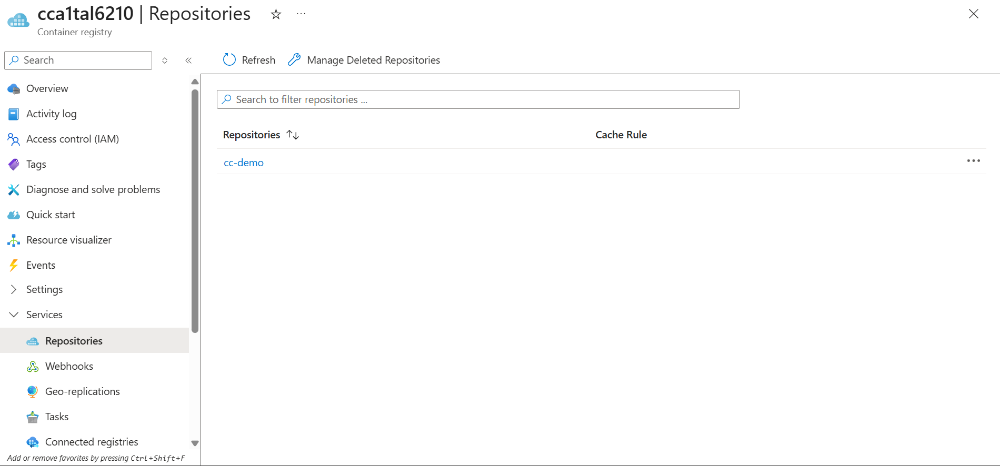
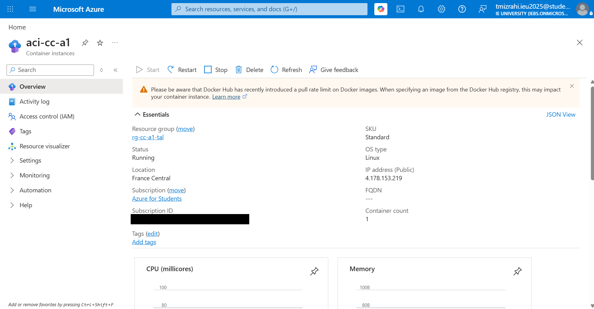
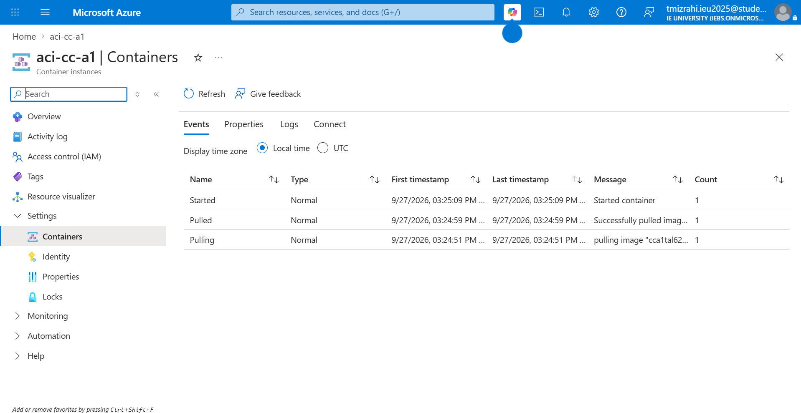
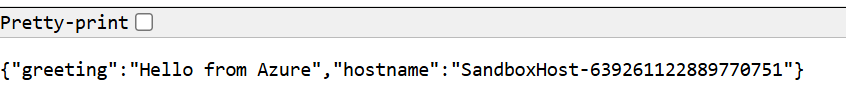

# Assignment 1 — Containerise and deploy

**Name:** Tal Mizrahi

**Campus:** Segovia

## What this is

The app is a small Flask API with three endpoints: `/` returns a greeting, `/count` increases a
counter stored in `/data`, and `/healthz` sends back the state of the app, `{"status":"ok"}`
with a 200 response. I wrote the Dockerfile, ran the app as a container, measured the size
differences between three ways of building the image (`Dockerfile.a`, `Dockerfile.b` and my
multi-stage `Dockerfile`), and deployed the app to Azure.

## Build and run it locally

The commands below are for a bash shell (Linux, macOS, or Git Bash on Windows). In Windows
PowerShell, use `curl.exe` instead of `curl` and `Start-Sleep 3` instead of `sleep 3`.

```bash
docker build -t cc-app:1.0 .
docker run -d --name cc -p 8000:8000 -v ccdata:/data cc-app:1.0
sleep 3
curl http://localhost:8000/
curl http://localhost:8000/count
curl http://localhost:8000/healthz
docker exec cc id
```

Expected output:

```
{"greeting":"Hello from the container","hostname":"2a68251746b0"}
{"count":1,"stored_in":"/data/counter.json"}
{"status":"ok"}
uid=6210(user6210) gid=6210(user6210) groups=6210(user6210)
```

Show the counter surviving a container restart:

```bash
curl http://localhost:8000/count
docker rm -f cc
docker run -d --name cc -p 8000:8000 -v ccdata:/data cc-app:1.0
sleep 3
curl http://localhost:8000/count
```

Expected output. The count carries on from 2 to 3 even though the container was replaced,
because the counter file lives in the named volume `ccdata`:

```
{"count":2,"stored_in":"/data/counter.json"}
cc
1e5bb1b5888aae21b6f1d8b074069b049506d198d3d03fa72b54b48860c1762d
{"count":3,"stored_in":"/data/counter.json"}
```

Overriding configuration at run time:

```bash
docker rm -f cc
docker run -d --name cc -p 8000:8000 -v ccdata:/data -e GREETING="Hi from Tal" cc-app:1.0
sleep 3
curl http://localhost:8000/
```

Expected output:

```
cc
03db806302e5f84b380e80442db56ef84ef57dac83d94fd8d0f794648e285d07
{"greeting":"Hi from Tal","hostname":"03db806302e5"}
```

### Why the Dockerfile looks like this

The `Dockerfile` has two stages. The builder stage creates a virtual environment in
`/opt/venv` and installs `requirements.txt` into it, and the final stage only copies that
folder, so anything needed to install the dependencies stays behind in the builder. Both
stages use `python:3.12.14-slim`, pinned to an exact version instead of `latest`, so a rebuild
next month gets the same Python. `requirements.txt` is copied and installed before `app.py`, so
changing the code does not reinstall Flask (B2 and B3 show this with the `CACHED` markers).

The app runs as `user6210` (uid 6210), not root. The user is created and `/data` is created and
given to that user before `VOLUME /data`, because a named volume takes the ownership of the
folder from the image. If `/data` still belonged to root, the app could not write the counter
file. All configuration comes from environment variables with defaults set by `ENV`, so it can
be changed with `-e` at `docker run` without rebuilding, and `PYTHONUNBUFFERED=1` makes the
app's output show up straight away in `docker logs` and `az container logs`. The image
`EXPOSE`s port 8000, and the port on the host is chosen at run time with `-p`.

## Configuration

| Variable | Default | What it does |
|:--|:--|:--|
| `GREETING` | `Hello from the container` | Text returned by `GET /`. Override with `-e GREETING="..."` to change the response without rebuilding. |
| `DATA_DIR` | `/data` | Folder where the counter file is stored. Matches the `VOLUME` and the folder owned by `user6210`, so the named volume can be written to. |
| `PORT` | `8000` | Port the app listens on inside the container. Published to the host with `-p <host>:8000`. |


## Part B — layers and cache

### B1 — image size

Sizes are the sum of each image's layers from `docker history` (uncompressed). The
compressed size that is actually pushed and pulled (`CONTENT SIZE` in `docker image ls`)
is given in brackets. All three images were built natively for linux/arm64.

| Build | Base | Stages | Size |
|:--|:--|--:|--:|
| A — single-stage, full base | `python:3.12.14` | 1 | ≈ 1,217 MB (405 MB) |
| B — single-stage, slim base | `python:3.12.14-slim` | 1 | ≈ 175 MB (48.5 MB) |
| C — my `Dockerfile` | `python:3.12.14-slim` | 2 | ≈ 179 MB (49.1 MB) |

| Step | Saves | What left the image |
|:--|--:|:--|
| A → B | ≈ 1,042 MB | Compilers, development headers and tools (gcc, g++, imagemagick, git, etc.) from the full base image's `apt-get install` layers, and a larger Debian base layer |
| B → C | ≈ −4 MB (C is bigger) | Nothing significant; C gained a second copy of pip inside `/opt/venv` |

Evidence (full output in `evidence/b1-sizes.txt` and `evidence/b1-site-packages.txt`):

```
IMAGE       ID             DISK USAGE   CONTENT SIZE   EXTRA
cc-demo:a   d2a54a60a9ca       1.62GB          405MB
cc-demo:b   bd2d89035528        223MB         48.5MB
cc-demo:c   0d7938084e70        228MB         49.1MB   U
```

**A → B:** There is a difference of 1,042 MB because A uses the full `python:3.12.14` base and
B uses `python:3.12.14-slim`. Looking at `docker history`, most of it is three layers that only
the full base has: 679 MB of compilers and development headers (`gcc`, `g++`, `make`,
`libpq-dev`, `libssl-dev`, `imagemagick` and more), 208 MB of version control tools (`git`,
`mercurial`, `subversion`, `openssh-client`) and 63.7 MB of download tools (`curl`, `wget`,
`gnupg`). That is about 951 MB. The rest comes from a bigger Debian base layer (156 MB against
110 MB) and bigger layers for installing Python itself (about 95 MB against 50 MB). All of
this is wasted, because even though these tools are part of the image, so they are stored and
downloaded every time, the Flask app never uses them when it runs. It only needs Python and
Flask.

**B → C:** All the base layers are the same in both images (110 MB, 4.99 MB and 44.6 MB). The
only difference is the layer with the dependencies: in B, `pip install` adds 15.5 MB, and in C,
`COPY --from=builder /opt/venv` adds 19.3 MB. That is 3.8 MB, so about 4 MB more for C, because
the venv has its own copy of pip on top of the one already in the base image
(`evidence/b1-site-packages.txt` shows `pip` in both places). So C has pip twice, which makes
it heavier with no additional benefits.

Multi-stage did not help here because the builder stage had nothing big to leave behind:
installing Flask needs no compilers or build tools. So A → B did much more work (about
1,042 MB) than B → C, which saved nothing and actually added 4 MB.

In a case where a dependency has to be compiled when it is installed, rather than coming as a
ready-made binary (a wheel), the image also needs compiler tools like `gcc` and development
headers. Those are going to create the actual size difference, not the app or the dependency
itself. An example of this would be a Flask app that uses PostgreSQL through `psycopg2`, which
needs `gcc` and `libpq-dev` to build. On the slim base, a single-stage build has to install
those tools, and they stay in the final image. In a multi-stage build they are only installed in
the builder stage, and the final stage only copies the finished `/opt/venv` and installs the
small runtime library `libpq5`, so the compilers are left behind and B → C would save a lot
more.


### B2 — changing one line of source

I changed the response of the `/healthz` endpoint in `app.py` 
to `"ok -b2"`. `COPY app.py .` was the layer that was 
rebuilt, as Docker found a change in `app.py` that wasn't 
built yet. The rest of the instructions in the Dockerfile 
stayed cached, as Docker only cares about inputs and 
instructions, and they didn't change besides `app.py`. When a step changes, all the steps after it have to rebuild while the steps before it stay cached, and since `COPY app.py .` is near the end of the Dockerfile, after `pip install`, the dependency install stayed cached. In a Dockerfile with a different order this might not be the case. 


```
#6 [builder 1/4] FROM docker.io/library/python:3.12.14-slim@sha256:f77ac9e44ae96ef2c90b8053ea08c31f8be030f824196b0ae4db6d462c84e51f
#6 resolve docker.io/library/python:3.12.14-slim@sha256:f77ac9e44ae96ef2c90b8053ea08c31f8be030f824196b0ae4db6d462c84e51f 0.0s done
#6 DONE 0.0s

#7 [builder 2/4] RUN python -m venv /opt/venv
#7 CACHED

#8 [builder 3/4] COPY requirements.txt .
#8 CACHED

#9 [stage-1 3/5] COPY --from=builder /opt/venv /opt/venv
#9 CACHED

#10 [builder 4/4] RUN pip install --no-cache-dir -r requirements.txt
#10 CACHED

#11 [stage-1 2/5] RUN useradd --create-home --uid 6210 "user6210"  && mkdir -p /data  && chown user6210:user6210 /data
#11 CACHED

#12 [stage-1 4/5] WORKDIR /app
#12 CACHED

#13 [stage-1 5/5] COPY app.py .
#13 DONE 0.0s

#14 exporting to image
#14 exporting layers 0.1s done
#14 naming to docker.io/library/cc-demo:b2 done
#14 DONE 0.3s
```

### B3 — making the cache worse

In `Dockerfile.bad` the same files are built in a different order: `COPY app.py .` comes
before `pip install`. The output shows the effect: in B2 `pip install` was `CACHED`, but here
it says `DONE`, so it had to run again and re-download Flask, and the lines after it had to
rebuild too. Only `FROM` and `useradd` stayed `CACHED`, so every code change now means a
slower build. When `COPY app.py .` is at the start, a change to `app.py` causes every line that
follows it to rebuild, rather than only a few lines at the end.

The rule I broke is that files that change often should be copied after the dependencies are
installed, and files that rarely change, like `requirements.txt`, should come before.

`Dockerfile.bad` is the same as `Dockerfile` except that `COPY app.py .` has moved to the
top of the builder stage, and the final stage copies it from the builder:

```dockerfile
FROM python:3.12.14-slim AS builder
COPY app.py .
RUN python -m venv /opt/venv
ENV PATH="/opt/venv/bin:$PATH"
COPY requirements.txt .
RUN pip install --no-cache-dir -r requirements.txt
...
COPY --from=builder /app.py .
```

Build output after changing `/healthz` to `"ok -b3v3"` (full log in `evidence/b3-cache.txt`):

```
#6 [builder 1/5] FROM docker.io/library/python:3.12.14-slim@sha256:f77ac9e44ae96ef2c90b8053ea08c31f8be030f824196b0ae4db6d462c84e51f
#6 resolve docker.io/library/python:3.12.14-slim@sha256:f77ac9e44ae96ef2c90b8053ea08c31f8be030f824196b0ae4db6d462c84e51f 0.0s done
#6 CACHED

#7 [builder 2/5] COPY app.py .
#7 DONE 0.0s

#8 [builder 3/5] RUN python -m venv /opt/venv
#8 DONE 3.4s

#9 [builder 4/5] COPY requirements.txt .
#9 DONE 0.1s

#10 [builder 5/5] RUN pip install --no-cache-dir -r requirements.txt
#10 0.614 Collecting flask==3.1.0 (from -r requirements.txt (line 1))
#10 0.689   Downloading flask-3.1.0-py3-none-any.whl.metadata (2.7 kB)
#10 0.729 Collecting Werkzeug>=3.1 (from flask==3.1.0->-r requirements.txt (line 1))
#10 0.742   Downloading werkzeug-3.1.8-py3-none-any.whl.metadata (4.0 kB)
#10 0.767 Collecting Jinja2>=3.1.2 (from flask==3.1.0->-r requirements.txt (line 1))
#10 0.779   Downloading jinja2-3.1.6-py3-none-any.whl.metadata (2.9 kB)
#10 0.813 Collecting itsdangerous>=2.2 (from flask==3.1.0->-r requirements.txt (line 1))
#10 0.825   Downloading itsdangerous-2.2.0-py3-none-any.whl.metadata (1.9 kB)
#10 0.857 Collecting click>=8.1.3 (from flask==3.1.0->-r requirements.txt (line 1))
#10 0.870   Downloading click-8.5.0-py3-none-any.whl.metadata (2.6 kB)
#10 0.884 Collecting blinker>=1.9 (from flask==3.1.0->-r requirements.txt (line 1))
#10 0.899   Downloading blinker-1.9.0-py3-none-any.whl.metadata (1.6 kB)
#10 0.951 Collecting MarkupSafe>=2.0 (from Jinja2>=3.1.2->flask==3.1.0->-r requirements.txt (line 1))
#10 0.965   Downloading markupsafe-3.0.3-cp312-cp312-manylinux2014_aarch64.manylinux_2_17_aarch64.manylinux_2_28_aarch64.whl.metadata (2.7 kB)
#10 0.978 Downloading flask-3.1.0-py3-none-any.whl (102 kB)
#10 1.000 Downloading blinker-1.9.0-py3-none-any.whl (8.5 kB)
#10 1.034 Downloading click-8.5.0-py3-none-any.whl (125 kB)
#10 1.056 Downloading itsdangerous-2.2.0-py3-none-any.whl (16 kB)
#10 1.071 Downloading jinja2-3.1.6-py3-none-any.whl (134 kB)
#10 1.106 Downloading werkzeug-3.1.8-py3-none-any.whl (226 kB)
#10 1.140 Downloading markupsafe-3.0.3-cp312-cp312-manylinux2014_aarch64.manylinux_2_17_aarch64.manylinux_2_28_aarch64.whl (24 kB)
#10 1.159 Installing collected packages: MarkupSafe, itsdangerous, click, blinker, Werkzeug, Jinja2, flask
#10 1.610 Successfully installed Jinja2-3.1.6 MarkupSafe-3.0.3 Werkzeug-3.1.8 blinker-1.9.0 click-8.5.0 flask-3.1.0 itsdangerous-2.2.0
#10 1.729 
#10 1.729 [notice] A new release of pip is available: 25.0.1 -> 26.2.1
#10 1.729 [notice] To update, run: pip install --upgrade pip
#10 DONE 1.8s

#11 [stage-1 2/5] RUN useradd --create-home --uid 6210 "user6210"  && mkdir -p /data  && chown user6210:user6210 /data
#11 CACHED

#12 [stage-1 3/5] COPY --from=builder /opt/venv /opt/venv
#12 DONE 0.3s

#13 [stage-1 4/5] WORKDIR /app
#13 DONE 0.1s

#14 [stage-1 5/5] COPY --from=builder /app.py .
#14 DONE 0.1s

#15 exporting to image
#15 exporting layers 1.0s done
#15 naming to docker.io/library/cc-demo:b3 done
#15 DONE 1.6s
```

## Part C — Azure

The commands I ran, in order. They are PowerShell because that is the shell I used on
Windows. The laptop is arm64 and ACI runs amd64, so the image is built for `linux/amd64`
without provenance or SBOM attestations.

```powershell
# names used throughout
$RG = "rg-cc-a1-tal"; $LOC = "francecentral"; $ACR = "cca1tal6210"

# resource group and registry (admin user disabled, no passwords)
az acr check-name --name $ACR -o table
az group create --name $RG --location $LOC -o table
az acr create --resource-group $RG --name $ACR --sku Basic --admin-enabled false -o table

# build for ACI's CPU (the laptop is arm64) and push
az acr login --name $ACR
docker build --platform linux/amd64 --provenance=false --sbom=false -t "$ACR.azurecr.io/cc-demo:v1" .
docker push "$ACR.azurecr.io/cc-demo:v1"
az acr repository show-tags --name $ACR --repository cc-demo -o table

# user-assigned managed identity with pull-only access to this registry
az identity create -g $RG -n id-cc-a1 -o table
$ID = az identity show -g $RG -n id-cc-a1 --query id -o tsv
$PRINCIPAL = az identity show -g $RG -n id-cc-a1 --query principalId -o tsv
$ACRID = az acr show -n $ACR --query id -o tsv
az role assignment create --assignee-object-id $PRINCIPAL --assignee-principal-type ServicePrincipal --role AcrPull --scope $ACRID
az role assignment list --assignee $PRINCIPAL --scope $ACRID --query "[].roleDefinitionName" -o tsv

# run on ACI with a public IP, one plain and one secure environment variable
az container create -g $RG -n aci-cc-a1 --image "$ACR.azurecr.io/cc-demo:v1" --os-type Linux `
  --cpu 1 --memory 1 --ports 8000 --ip-address Public `
  --assign-identity $ID --acr-identity $ID `
  --environment-variables 'GREETING=Hello from Azure' `
  --secure-environment-variables 'SECRET_TOKEN=not-a-real-secret'

# evidence
az container show -g $RG -n aci-cc-a1 --query "{name:name, state:instanceView.state, provisioning:provisioningState, image:containers[0].image, os:osType, ip:ipAddress.ip, port:ipAddress.ports[0].port, identity:identity.type}" -o json   # c2-aci.txt
az container logs -g $RG -n aci-cc-a1                   # c2-aci.txt
$IP = az container show -g $RG -n aci-cc-a1 --query ipAddress.ip -o tsv
curl.exe -i "http://${IP}:8000/"                        # c3-request.txt (also /healthz, /count x2)
az container show -g $RG -n aci-cc-a1 --query "containers[0].environmentVariables" -o json   # c4-secure-var.txt

# clean up
az group delete --name $RG --yes
az group exists --name $RG                              # false
```

#### What Azure returned while it was running

The resource group has since been deleted, so this output (copied from `evidence/`) is the
record of the deployment. The image was built while `app.py` still contained the B3 edit,
which is why `/healthz` returns `"ok -b3v3"`. `app.py` in this repository is back to the
original `"ok"`.

**C1: image pushed to ACR** (`evidence/c1-acr.txt`). The image was built for `linux/amd64`
and the registry holds tag `v1`:

```
The push refers to repository [cca1tal6210.azurecr.io/cc-demo]
06ad939ed42b: Pushed
3764a9a7d1e8: Pushed
f037cf4a1889: Pushed
b996c5333548: Pushed
bfc2075b6144: Pushed
c4503275aa93: Pushed
6b37362b3da7: Pushed
b0dc7f87bef1: Pushed
v1: digest: sha256:e143deac5e69771d3ee459acda9f01a3975d3db288d5a31171b8d95a543ccda5 size: 1811

> az acr repository show-tags --name cca1tal6210 --repository cc-demo -o table
Result
--------
v1
```

**C2: container running on ACI** (`evidence/c2-aci.txt`):

```
{
  "identity": "UserAssigned",
  "image": "cca1tal6210.azurecr.io/cc-demo:v1",
  "ip": "20.19.132.70",
  "name": "aci-cc-a1",
  "os": "Linux",
  "port": 8000,
  "provisioning": "Succeeded",
  "state": "Running"
}
--- container logs ---
listening on port 8000
 * Serving Flask app 'app'
 * Debug mode: off
 * Running on all addresses (0.0.0.0)
```

**C3: requests to the public IP** (`evidence/c3-request.txt`, headers trimmed here):

```
> curl.exe -i http://20.19.132.70:8000/
HTTP/1.1 200 OK
{"greeting":"Hello from Azure","hostname":"SandboxHost-639261028674259153"}

> curl.exe -i http://20.19.132.70:8000/healthz
HTTP/1.1 200 OK
{"status":"ok -b3v3"}

> curl.exe -i http://20.19.132.70:8000/count
HTTP/1.1 200 OK
{"count":1,"stored_in":"/data/counter.json"}

> curl.exe -i http://20.19.132.70:8000/count
HTTP/1.1 200 OK
{"count":2,"stored_in":"/data/counter.json"}
```

**C4: the secure variable reads `null`** (`evidence/c4-secure-var.txt`):

```
> az container show -g rg-cc-a1-tal -n aci-cc-a1 --query containers[0].environmentVariables
[
  {
    "name": "GREETING",
    "secureValue": null,
    "value": "Hello from Azure"
  },
  {
    "name": "SECRET_TOKEN",
    "secureValue": null,
    "value": null
  }
]
```

#### Screenshots from the Azure portal

These come from a second deployment of the same image (digest `e143deac…`), made with the
same commands only to take portal screenshots, and deleted again afterwards. It got a new
public IP, `4.178.153.219`. The text record of it is in `evidence/c5-portal-redeploy.txt`. The
subscription ID is blacked out.

**The image in ACR:** registry `cca1tal6210` holding the `cc-demo` repository.



**The container running in ACI:** status Running, public IP, Linux, France Central.



**ACI pulling the image from ACR and starting it:**



**A request to the public IP in the browser.** The hostname matches the `curl` output in
`evidence/c5-portal-redeploy.txt`.



#### Screenshots of the terminal session

Subscription, tenant and identity IDs are blacked out in the identity screenshot.

**C1: building the image for `linux/amd64` and pushing it to ACR**


**C2: managed identity with AcrPull, then the container created and running on ACI**


**C2 and C3: container state, logs, and requests to the public IP**


**C4 and clean-up: the secure variable reads `null`, and the resource group is deleted**


Which value you passed as a **secure** environment variable, and how you know it is not
readable afterwards:

I passed `SECRET_TOKEN` as a secure environment variable, with the placeholder value
`not-a-real-secret` rather than a real secret. I proved it is secure by requesting the
container's configuration from Azure's control plane with `az container show` after the
deployment: Azure
returned `null` for `SECRET_TOKEN`, while the normal variable `GREETING` showed its value,
`Hello from Azure` (see C4 above).

Every capture is listed in [`evidence/README.md`](evidence/README.md).

## Before this went to production

Three things would bite this app first. The first is the server: the app runs on Flask's
built-in development server, and the ACI logs warn that it should not be used in production.
It can handle a few users at a time, but it is not built for many, so it would need a
production server such as Gunicorn. The second is the counter. On ACI, `/data` was not a
persistent volume, so if the container is restarted or replaced the counter file is lost and
the count starts again from 1; locally it only survived because of the named volume
`ccdata`, so Azure would need a mounted volume such as Azure Files. The counter also reads the
file and writes it back with no lock, so two requests at the same moment can both read the
same number and one count is lost. The third is security: anyone can reach the app as long
as it is running, because it sat on a public IP over plain HTTP with no login, so anyone could
call `/count` and change the number. It should be behind HTTPS and some form of
authentication.

## AI use

I used only Claude (Anthropic), first in a chat session and then in Claude Code inside VS
Code. It explained the theory as I worked (image layers, the build cache, multi-stage builds,
ACR, ACI and managed identities), gave me the commands to run for Parts B and C, and helped me
with my `Dockerfile`. captured some of the evidence, and wrote parts of this
README: the section on why the Dockerfile looks like this, the Part C commands and output, the
evidence index, the Sources section and formatting fixes. The explanations are my own answers;
Claude fixed my sentences, made them more accurate and added the `docker history` numbers to B1.

## Sources

The application (`app.py`, `requirements.txt`), the `.gitignore` and the evidence checklist
come from the course starter in
[fjsuarez/cloud-computing-labs](https://github.com/fjsuarez/cloud-computing-labs),
`assignment-1`. `Dockerfile.a`, `Dockerfile.b` and `Dockerfile.bad` were written with Claude
(see AI use). The documentation I relied on:

- Docker, [Multi-stage builds](https://docs.docker.com/build/building/multi-stage/)
- Docker, [Build cache](https://docs.docker.com/build/cache/)
- Docker, [Dockerfile reference](https://docs.docker.com/reference/dockerfile/)
- Docker Hub, [official `python` image](https://hub.docker.com/_/python) (tags `3.12.14` and `3.12.14-slim`)
- Microsoft Learn, [Deploy to ACI from ACR using a managed identity](https://learn.microsoft.com/en-us/azure/container-instances/using-azure-container-registry-mi)
- Microsoft Learn, [Set environment variables in container instances](https://learn.microsoft.com/en-us/azure/container-instances/container-instances-environment-variables) (secure values)
- Microsoft Learn, [Azure Container Registry roles and permissions](https://learn.microsoft.com/en-us/azure/container-registry/container-registry-roles) (`AcrPull`)
- Microsoft Learn, [`az container` CLI reference](https://learn.microsoft.com/en-us/cli/azure/container)
